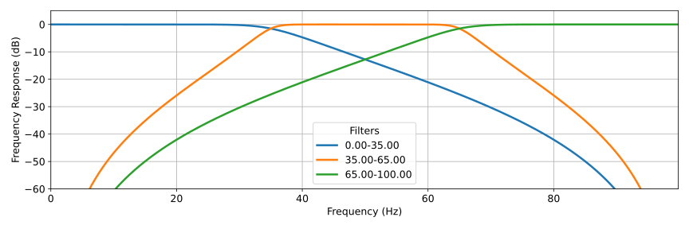
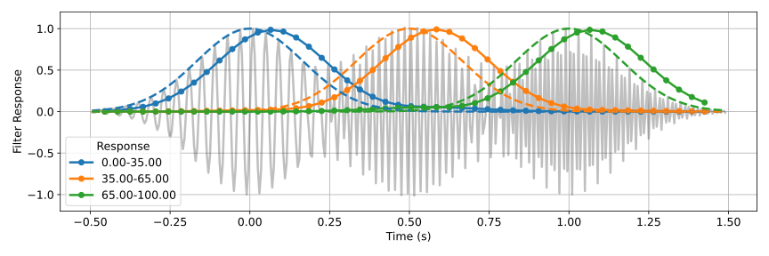

# tf-stream 
## Time-Frequency Analysis for Streaming Signals

tf-stream is a simple and practical Python toolbox for time-frequency analysis on streaming signals. Signals can be decomposed through various techniques into an approximation of their spectral content instantaneously in time. This problem is relevant to processing complicated real-world signals, such as neural recordings, sound, financial data, etc. However, doing so under streaming conditions, i.e., in real-time, can be a technical headache. There are many possible solutions; some are better than others, given a certain application context. This repository catalogues solutions developed in research into a practical toolbox that can be conjointly used with the other great signal-processing resources already available in Python.

The following guiding principles are adopted:
* Simple functions to construct and operate time-frequency filter banks using `scipy.signal` and Matlab's syntax conventions.
* All filtering functions can process incoming signal blocks and use a `zi` variable to persist the filter memory into the next function call.
* It is assumed that signals are contained in `numpy` arrays (and later also in `pandas` dataframes).
* A 'functional-oriented' design was chosen over an 'object-oriented' one wherever possible. This design exposes better the inner workings of the toolbox as much as possible and makes it easier to build custom classes above the library. 
* Filters are tested on standardized signals and plots using simple function calls.

## Development Roadmap

This is a pre-alpha version with a limited number of features and workflow examples chosen to showcase the philosophy and structure adopted in this library.

The planned content is the following:
* (Pre-alpha) Filter-bank and epoching tools for time-frequency analysis.
* (Pre-alpha) Fourier and wavelet transforms.
* (In development) Phasor estimation (including Hilbert transformers).
* (Planned) Baseline deviation and signal whitening.
* (Planned) Recursive and discrete wavelet transforms.
* (Planned) Parametric auto-regressive estimators.
* (Planned) Signal decomposition strategies.
* (Planned) Noise reduction strategies.

Interested in contributing? Please contact Thomas Martineau at tlc.martineau@gmail.com.

## Dependencies
* Python 3.10.9 (or later)
* Numpy 1.23.5 
* Pandas 1.5.3 
* Scipy 1.10.0
* Matplotlib 3.7.0

## License

Copyright 2023 Thomas Martineau

Permission is hereby granted, free of charge, to any person obtaining a copy of this software and associated documentation files (the "Software"), to deal in the Software without limitation in the rights to use, copy, modify, merge, publish, and/ or distribute copies of the Software in an educational or personal context, subject to the following conditions: 

- The above copyright notice and this permission notice shall be included in all copies or substantial portions of the Software.

Permission is granted to sell and/ or distribute copies of the Software in a commercial context, subject to the following conditions:

- Substantial changes: adding, removing, or modifying large parts, shall be developed in the Software. Reorganizing logic in the software does not warrant a substantial change. 

THE SOFTWARE IS PROVIDED "AS IS", WITHOUT WARRANTY OF ANY KIND, EXPRESS OR IMPLIED, INCLUDING BUT NOT LIMITED TO THE WARRANTIES OF MERCHANTABILITY, FITNESS FOR A PARTICULAR PURPOSE AND NONINFRINGEMENT. IN NO EVENT SHALL THE AUTHORS OR COPYRIGHT HOLDERS BE LIABLE FOR ANY CLAIM, DAMAGES OR OTHER LIABILITY, WHETHER IN AN ACTION OF CONTRACT, TORT OR OTHERWISE, ARISING FROM, OUT OF OR IN CONNECTION WITH THE SOFTWARE OR THE USE OR OTHER DEALINGS IN THE SOFTWARE.

# Pre-Alpha Userguide

## Introduction

This user guide assumes that the reader has some elementary understanding of the `scipy.signal` library and of signal processing: discrete-time signals, filter design, frequency response, infinite-response (IIR) vs. finite-response (FIR)... etc.

Time-frequency analysis is useful to decompose multi-modal and non-stationary signals. We can define a mode as a carrier signal whose amplitude (AM) and frequency (FM) are modulated in time (at a lower rate than the base frequency) such that: $$x(t)=\sum_{i=0}^{N-1} A_i(t)sin(\phi_i(t))$$ where $A_i(t)$ is the amplitude and $\phi_i(t)$ function of a mode [1]. The instantaneous frequency function of the mode is given by $f_i(t)=\frac{1}{2\pi}\frac{d\phi_{i}}{dt}$ [1]. Although this model does not describe all types of real-world signals (e.g. random signals), it is sufficiently broad to derive different problem classes, which can, in turn, be used for demonstration and testing.

This guide will discuss:
* How to construct simple filter banks to estimate $A_i(t)$ components.
* Use complex-narrow band filters to estimate $\phi_i(t)$.
* Present resources for Fourier & Wavelet analysis.

## Filter Banks, Epoching and Streaming

Let us consider a first problem, where $\phi_{i}(t)$ are rotating at different fix frequencies $f_{i}$ (i.e., $\phi_{i}(t)=2\pi f_{i}t$) but undergo different asynchronous amplitude modulation. Because $\phi_i$ behaves predictably within a given bandwidth, it is possible to use a set of bandpass filters (or a bank) to estimate $A_i(t)$.

In the following example, $f_{i}$ are equally spaced such that $f_{i} = 25, 50, 75$ Hz and $A_i(t)$ are defined as Gaussian pulses also equally distributed in time. First, let us build an adequate filter bank to isolate the modes:

```python
# %% Imports
from matplotlib import pyplot as plt
import numpy as np
from scipy.signal import butter

from tfstream.bank import get_filter_bank, lfilter_bank
from tfstream.epoch import view_epoch
from tfstream.plots import plot_freqz_bank, plot_am_test
from tfstream import utils

# %% Gaussian Pulse 
# (1) Build & Inspect Filter Bank
fs = 200
bands = [0, 35, 65, 100]
b, a = get_filter_bank(6, bands, _filter=butter, fs=fs)
plot_freqz_bank(b, a, fs=fs)

```
`get_filter_bank` builds the filter arrays `(b, a)` using `bands` and a filter backend function from `scipy.signal`. A list of frequencies will partition the spectra using bandpass filters and a pair of low-highpass filters for the spectra edges. Passing a list of frequency pairs inside a tuple will generate a customized partition. 

`plot_freqz_bank` wraps around `scipy.signal.freqz` to plot the characteristics of every filter in the bank. Each $f_{i}$ is located within the passband of its respective filter.

<figure>
  
  <center><font size="2">IIR-Filter bank used to capture AM modes at 25, 50 and 75Hz.</font></center>
</figure>

We can build the processing pipeline into a `_filter` function. The `plot_am_test` function will automatically create a test signal `x` using `tfstream.generator.gaussian_am_modes` and create a summary plot.  

```python
# define epoching settings.
R, n = 8, 1

# (2) Build pipeline and run example.
def _filter(x):
    # break signal the x-signal into 3-components.
    y = lfilter_bank(b, a, x) # y.shape = (3, x.shape[0])
    
    # downsample R into epoch window.
    y = view_epoch(y, R, n) # y.shape = (3, x.shape[0]/R, R(n+1))
    
    # root-mean square estimation of A(t), with correction sqrt(2) scaling.
    # https://en.wikipedia.org/wiki/Root_mean_square
    return np.sqrt(2)*y.std(axis=-1)  # y.shape = (3, x.shape[0]/R)

plot_am_test(
    _filter, # pass on the filtering pipeline.
    labels=b.index,
    fs=fs, T=1, scale=0.5) # signal generator parameters.
```

<figure>
  
  <center><font size="2"> Filter bank output after epoching, decimation and RMS estimation (solid lines with round markers; grey traces are the test signal and dash lines are the reference envelopes)</font></center>
</figure>

`lfilter_bank` function wraps around `scipy.signal.lfilter` to decompose `x` into `y` using `(b, a)`. 

$A_i(t)$ is estimated using the root-mean-square operator and applied on a rolling window or epoch. `epoch_view` takes in two arguments: $R$, which defines the stride between windows; $n$, which extends the epoch length $L$ by specifying the number of strides which overlap between epochs such that $L=R(n+1)$ ($n=0$ means there is not overlap). Standard `numpy` operations can then be directly applied to the array.

The code can be easily modified to function under streaming conditions (i.e. online). In a high-level Python application, data will typically be received in packets (chunks, blocks, etc.) through some socket (e.g. a serial port using the `pyserial` or a custom device driver). A chunk of data contains multiple time samples. In practice, the chunk size dictates when the filters can be updated. It is thus often easier to set $R$ to match the size of that chunk:

```python
# %% Streaming.
from tfstream.bank import lfilter_zi_bank
from tfstream.epoch import buffer_epoch
from tfstream.generator import gaussian_am_modes

# epoch parameters.
R, n = 8, 1

def _filter(x, z):
    # check the chunk is the correct size.
    assert x.shape[-1] == R
    
    # break signal the x-signal into 3-components.
    y, z[0] = lfilter_bank(b, a, x, zi=z[0]) # 
     
    # downsample R into epoch window.
    if n > 0:
        y, z[1] = buffer_epoch(y, R, n, z[1]) # y.shape = (x.shape[0]/R,3,R(n+1))
        
    return np.sqrt(2)*y.std(axis=-1), z

# test signal.
_, x, _ = gaussian_am_modes(fs=fs, T=1, scale=0.5)
y = []
z = [lfilter_zi_bank(b, a), None]

for chunk in utils.split_evenly(x.sum(axis=0), R):
    yi, z = _filter(chunk, z)
    y.append(yi)

# assemble the final signal.
y = np.asarray(y)
```
In summary, the resulting approximations of $A_i(t)$ are relatively good, provided that the latency and decimation levels are acceptable for the desired application. Again, this approach is efficient, straightforward and most likely applicable to a broad range of signals. `tfstream` provides simple functions to fast-track implementation whether the data is processed offline or online from a streaming source. The key assumption is that the frequency function behaviour of a mode is well-known and sufficiently stable within a given band. Lastly, to reduce noise sources present within the carrier or in $A_i(t)$, it is advisable to have longer epochs, thus allowing for more latency. Otherwise, more advance techniques, such as post-processing smoothers, need to be employed.

## Fourier Transforms

Let us now consider that $\phi_i(t)$ follows a more complicated and non-band limited behaviour. For example, in a simple chirp signal, the instantaneous frequency follows a steady ramp such that $f_i(t)=mt+p$. A straightforward way to track $\phi_i(t)$ is the following: 
$$l[k] = \underset{l=0,...,N-1}{\mathrm{argmax}}(|y[k,l]|)$$ where $k$ is the time index, $l$ the filter bank index, and $y$ the output signal from the filter bank. The full spectrum needs to be sampled through a set of bases from which the modes can be estimated. The finer the spanning, the better the approximation.  Building narrow real-value bandpass filters is often sub-optimal. IIR filters tend to become unstable and FIR overly long.

A more robust approach is to construct instead a narrow complex-value filter, starting with a short window function $w_n$. The peak response of the window discrete-time Fourier transform $W(j\omega)$ can be shifted from the central frequency across the spectra through the following identity: $$w[n]e^{j\omega_{0} n} \leftrightarrow W(j(\omega-\omega_o))$$ A bank of such shifted complex filters be constructed to sample the signal spectra at regularly spaced frequency points.

### STFT
The Short-time Fourier transform (STFT) can be interpreted as a complex filter bank [2]. The transform is however typically computed using the FFT algorithm after signal epoching, which is far more efficient than convolving large complex FIR filters. Following this approach, `tfstream.fourier.stft` combines `tfstream.epoch` and `scipy.signal.fft` for both efficient streaming (by specifying the `zi` variable) and offline deployment. 

```python
# %% STFT
from tfstream.fourier import stft, get_stft_freq
from tfstream.plots import plot_chirp_test
from tfstream import utils

fs = 200
fig, axes = plt.subplots(1, 3, sharey=True, figsize=(12,4)) # for plotting.

# different R, n paramater pairs are tests.
for (R, n), ax, legend, cmb in zip(
        [(16, 0), (25, 4), (50, 8)], axes, 
        [True, False, False], [False, False, True] ): 
    
    #  applies FFT on epochs of size L=R(n+1) using a Kaiser window with shape factor 1.
    plot_chirp_test(
        lambda x: utils.dB(stft(x, R, n, window = ('kaiser', 1))), 
        f=get_stft_freq(R, n, fs), # helper function to get the FFT frequencies
        ax=ax,
        add_colorbar=cmb,
        add_legend=legend,
        ylabel='Frequency (Hz)' if legend else None,
        fs=fs, f0=10, f1=75)
    
    ax.set_title('Window Length {} (ms)'.format(R*(n+1)/fs*1000)) 
```
`plot_chirp_test` automatically generates a chirp test signal and compiles a diagnostic plot. Different settings for the `stft` functions were selected and tested. `utils.dB` applies the Decibel scale to the transform complex-norm. `scipy.signal.window` function names and parameters can be directly pasted to `stft`.

A drawback of using the FFT is that the frequency points are constrained by the epoch length. Shorter epochs have poorer frequency resolution, which leads to a gross step-like estimate. Longer epochs have poorer time resolution, which leads to a lagging and noisy estimate. Adjusting the poch length to match the characteristic of $\phi_i(t)$ is therefore important. 

<figure>
  
  <center><font size="2"> STFT spectrogram using different epoching parameters with phase tracking estimation; reference chirp signal is running from 10 to 75Hz over 10s.</font></center>
</figure>


### SWIFT
To overcome some of the practical constraints of the STFT, [2] proposed a light recursive formulation of the Fourier transform using an exponential window function named  'Sliding Windowed Infinite Fourier Transform' or SWIFT. This approach has several benefits of the traditional FFT: a single filter computation is efficient and can be carried at fast sampling rates, frequency points can be arbitrarily set depending on the signal and exponential decay parameters can be adjusted to accommodate the modulation functions. 

```python
# %% SWIFT
from tfstream.fourier import swift
from tfstream import utils

f = utils.freq_linear_scale(fs, 5) # frequency to sample.
b, a = swift(f, fs, tau = 30) # filter construction using a tau-time constant of 30.
plot_freqz_bank(b, a, ylim=(0, 15), fs=fs)

# apply the chirp test.
plot_chirp_test(
    lambda x: utils.dB(lfilter_bank(b, a, x)),
    f = f,
    fs = fs,
    add_colorbar=False,
    ax = ax1)

ax1.set_title('SWIFT')

```
<figure>
    
    <center><font size="2"> SWIFT filter bank with a spanning from 0 to 100Hz and a 5Hz spacing between filters.</font></center>
</figure>

The `swift` function constructs an IIR filter bank `(b, a)` using a frequency spanning vector `f`. Here the `utils.freq_linear_scale` is used to generate `f` using a resolution of 5Hz. Like with the STFT, the complex-norm output is used to estimate the signal envelope at a given frequency.  

The second-order $\alpha$-SWIFT method [2] is also implemented under `tfsream.fourier.aswift`.

```python
b, a = aswift(f, fs) # alpha-swift.

# apply the chirp test.
plot_chirp_test(
    lambda x: utils.dB(lfilter_bank(b, a, x)),
    f = f,
    fs = fs,
    add_colorbar=True,
    add_legend=False,
    ylabel=None, 
    ax = ax2)

ax2.set_title(r'$\alpha$-SWIFT')
```

<figure>
    
    <center><font size="2"> SWIFT spectrogram with phase tracking estimation; reference chirp signal is running from 10 to 75Hz over 10s.</font></center>
</figure>

## Continuous Wavelet Transform
Much can be said about wavelet theory. `pywavelet` remains the library of reference in Python. The incentive here to is provide wavelet tools usable under streaming conditions.

Put very briefly, like the STFT or SWIFT, wavelet kernels are filter banks. Unlike Fourier bases, a wavelet's shape dilates or shrinks depending on its fundamental frequency. In practical terms, this means that wavelet filters span the spectral space logarithmically instead of linearly. Frequencies are geometrically placed along the spectra such that: $$f[k]=\frac{f_s}{2^{\frac{k-1}{M}}} $$ with M commonly referred to as the number of wavelets per octave [4]. 

The continuous wavelet transform (CWT) is thus efficient at capturing both fast-broadband and slow-narrowband signals. These properties suit many classes of real-world signals. Additionally, the shape of the wavelet may have other desirable effects (such as shape-matching a signal or control over the time/frequency resolution tradeoff).

### Morlet's Wavelet

Morlet's wavelet is extensively used for the analysis of bio-signals and many other applications. Its discrete kernel function $h$ consists of a complex sinusoid captured in a Gaussian envelope [4]:
$$h_{\omega}[k]=\mathrm{exp}(j\pi \omega k)\mathrm{exp}(-(k/s)^2) $$ where $\omega$ is the normalized frequency and the scaling factor $s=\frac{2n_c}{\pi \omega}$. $n_c$ is known as the number of cycles and controls the temporal-spectral resolution trade-off of the transform.

`tfstream.wavelets.morlet` can be used to build a kernel filter bank according to a frequency vector `f`:

```python
# %% Morlet's Wavelet.
from matplotlib.gridspec import GridSpec

from tfstream.wavelets import cwt, morlet
from tfstream.epoch import get_epoch_length
from tfstream.plots import plot_chirp_test, plot_freqz_bank
from tfstream import utils

# (a) Build a simple bank.
fs, R, n = 200, 50, 3
f = utils.freq_dyadic_scale(fs, per_octave=1, fmin=5,  include_nysquit=False)
h = morlet(f, fs, R, n, cycles=8)

# (b) Layout for plot.
fig = plt.figure(figsize=(12,4))
gs = GridSpec(1, 3, figure=fig)

ax1 = fig.add_subplot(gs[0, 0])
L = get_epoch_length(R, n)
t = (np.arange(0, L) - L//2)/fs
ax1.plot(t, h.T)
ax1.grid()
ax1.set_xlabel('Time (s)')
ax1.set_ylabel('Kernel-Real Part')

ax2 = fig.add_subplot(gs[0, 1:])
plot_freqz_bank(
    h, 1, 
    ylim = (-150, 30),
    log_freq=True,
    fs=fs,
    ax=ax2)
ax2.legend(f, title='Frequency (Hz)')
ax2.grid()
```

`utils.freq_dyadic_scale` will generate logarithmically spaced frequencies between `fs` and `fmin`. As it will be shown, the CWT requires long FIR kernels. Like with the STFT, it is computationally preferable to use sparser overlapping epochs rather than a full convolution (although there exists an offline FFT trick to accelerate that specific operation). `(R, n)` need to be passed to `tfstream.wavelets.morlet` to match the epoch length to the kernel size.

<figure>
    
    <center><font size="2"> Wavelet shape and filter bank frequency response using 8 cycles and 1 wavelet per octave.</font></center>
</figure>

`tfstream.wavelets.cwt` can then be called to epoch the signal and carry the transformation:

```python
fig, axes = plt.subplots(1, 3, figsize=(12,4),  sharey=True)
f = utils.freq_dyadic_scale(fs, per_octave=6, fmin=1,  include_nysquit=False)

for cycles, ax, legend, cmb, tag in zip(
        [6, 12, 24], axes,
        [True, False, False], [False, False, True],
        ['a', 'b', 'c']):
    
    h = morlet(f, fs, R, n, cycles=cycles)
    
    plot_chirp_test(
        lambda x: utils.dB(cwt(h, x, R, n)),
        f=f,
        fs=fs,
        method='logarithmic',
        ax=ax,
        add_colorbar=cmb,
        add_legend=legend,
        ylabel='Frequency (Hz)' if legend else None)
    
    ax.set_title('({}) N-cycles {}'.format(tag, cycles))

```

The `cwt` function operates similarly to `stft` with the exception that the kernel array `h` needs to be specified. Instead of a linear chirp, the argument `method` for `scipy.signal.chirp` was set to `logarithmic` to generate an exponential trajectory which matches well the frequency spanning of the CWT.

<figure>
    
    <center><font size="2"> CWT response between 1 and 100 Hz using 6 wavelets per octave and various number of cycles.</font></center>
</figure>

This example also shows the influence of the cycle number. It controls the damping of the wavelet oscillations. Tuning is typically required depending on the application.

The practical limitations of the CWT are associated with kernel building and convolution. Kernels are long and expensive to compute, so long-stride epoching is recommended. Their frequency response function is distorted at the spectral extremities: very slow wavelets are truncated at the epoch edges, leading to leakage and a shallow/distorted central lobe;  very fast wavelets are excessively padded, resulting in more zero-points than necessary and thus ill-conditioning of the filter function. Pre-conditioning the signal in a or several bands of interest (using band-passing and resampling), thus may be necessary. Other solutions to these problems include the recursive wavelets, and the discrete wavelet transforms.

## References

[1] Wikipedia Contributors. Chirp [Internet]. Wikipedia. Wikimedia Foundation; 2019. Available from: https://en.wikipedia.org/wiki/Chirp

[2] L. L. Grado, M. D. Johnson, and T. I. Netoff, “The Sliding Windowed Infinite Fourier Transform,” IEEE Signal Process Mag, vol. 34, no. 5, pp. 183–188, Sep. 2017, doi: 10.1109/MSP.2017.2718039.

[3] A. V. Oppenheim and R. W. Schafer, “The Time-Dependent Fourier Transform,” in Discrete-Time Signal Processing, Third Edit., Pearson, 2010, pp. 836–860. 

[4] B. Russell and J. Han, “Jean Morlet and the Continuous Wavelet Transform,” Consortium for Research in Elastic Wave Exploration Seismology, vol. 28, no. 1946, pp. 1–15, 2016.
